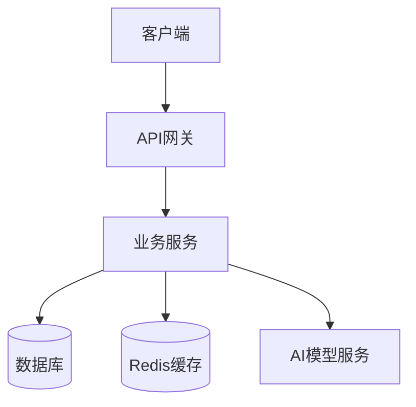

# 架构图制作指南

## 常见架构图类型
| 类型 | 用途 | 适用文档 |
|------|------|---------|
| 系统架构图 | 展示整体系统组成 | 技术报告 |
| 数据流图 | 展示数据流转路径 | API文档、数据库文档 |
| 部署架构图 | 展示服务器部署拓扑 | 技术报告 |
| ER关系图 | 展示数据库表关系 | 数据库设计文档 |
| 产业链图 | 展示上下游关系 | 市场数据报告 |

## 制作工具

| 工具 | 最适合画 | 官网 | 价格 |
|------|---------|------|------|
| draw.io | 所有类型 | https://app.diagrams.net | 免费 |
| Excalidraw | 手绘风架构图 | https://excalidraw.com | 免费 |
| ProcessOn | 标准架构图 | https://www.processon.com | 免费9个 |
| dbdiagram.io | ER图 | https://dbdiagram.io | 免费 |
| Mermaid | 代码生成图 | https://mermaid.live | 免费 |

## 方法一：用AI生成 → 工具绘制

### Prompt模板
```
# Role
你是一位资深技术架构师。

# Task
请为 [产品名称] 绘制 [架构图类型] 的文本描述，我将在draw.io中根据你的描述绘制。

# Context
- 系统组成：[组件列表]
- 核心流程：[数据流转方向]

# Output Format
## 图形元素清单
| 元素编号 | 元素名称 | 元素类型 | 所属层级 | 说明 |
|---------|---------|---------|---------|------|

元素类型：客户端/服务/数据库/缓存/消息队列/第三方/网关

## 连接关系
| 起点 | 终点 | 连接类型 | 标注 |
|------|------|---------|------|

连接类型：请求/响应/推送/读取/写入

## 分层建议
| 层级 | 包含元素 | 颜色建议 |
|------|---------|---------|
| 接入层 | | 蓝色 |
| 业务层 | | 绿色 |
| 数据层 | | 橙色 |
| 基础设施 | | 灰色 |
```

## 方法二：用Mermaid代码生成

在任意支持Mermaid的工具中（飞书文档、Notion、VS Code等）直接写代码：



在线编辑器：https://mermaid.live

## 绘制规范
- 使用一致的颜色编码（同层级同颜色）
- 标注数据流方向（箭头）
- 标注关键指标（QPS/延迟/存储量）
- 使用标准图标（数据库用圆柱形，服务用矩形等）
