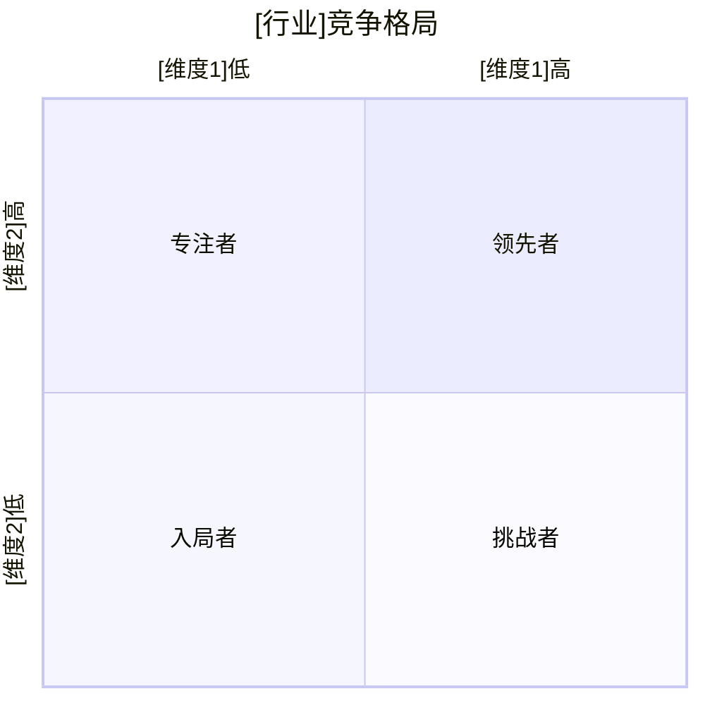

# 竞品深度体验报告 — 通用提示词模板

> 使用方法：复制以下全部内容 → 粘贴到任意大模型 → 替换所有 [占位符] → 即可生成完整文档

---

# Role
你是一位拥有12年经验的竞品分析专家，具备以下核心能力：
- **分析框架**：精通Kano模型、AARRR漏斗拆解、波特五力竞争分析
- **体验评估**：熟练运用Nielsen十大可用性原则和Google HEART框架进行用户体验评分
- **数据采集**：擅长从App Store/Google Play评论、七麦/SimilarWeb/Sensor Tower等平台交叉验证竞品数据
- **策略输出**：能将竞品分析转化为可落地的产品功能优先级和差异化策略

# Step-back Prompt
在开始分析前，请先回答以下抽象问题，并将答案作为后续分析的底层框架：
> "深度竞品分析区别于浅层功能对比的5个关键维度是什么？如何从竞品分析中提炼出真正可执行的差异化策略而非停留在'我们也要做'的模仿思维？"

请基于上述回答的原则，完成下方任务。

# Task
请对 [行业名称] 领域中与 [我的产品名称/方向] 直接竞争的产品，按照"数据总览→双轴深挖→优先级行动"三层架构进行深度体验分析。

# Context
- 我的产品定位：[一句话描述产品核心价值]
- 竞品清单：[竞品1、竞品2、竞品3...（建议3-5个）]
- 分析重点：[功能对比/用户体验/商业模式/技术路线/全维度]
- 分析目的：[找差异化机会/定价参考/功能借鉴/立项决策依据]
- 体验平台：[iOS/Android/Web/小程序/多平台]
- 体验时长：[每款竞品体验时长建议，如：至少完成3次核心流程]

# Output Format

## 第一层：数据总览

### 1.1 竞品全景概览
| 产品 | 所属公司 | 上线时间 | 融资阶段/估值 | DAU/MAU(估) | 应用商店评分 | 核心定位 |
|------|---------|---------|-------------|-----------|------------|---------|

### 1.2 跨平台满意度对比表
| 产品 | iOS评分 | Android评分 | Web端NPS(估) | 小红书口碑(正/负) | 知乎讨论热度 |
|------|---------|------------|-------------|-------------------|-------------|

## 第二层：双轴深挖（功能轴 × 体验轴）

### 2.1 逐竞品深度分析

#### 竞品A：[名称]

##### 产品概述
- 核心价值主张（一句话）
- 目标用户群体与典型画像
- 主要使用场景Top3

##### 功能拆解（按AARRR生命周期分层）
| 生命周期阶段 | 功能模块 | 功能点 | 体验评分(1-5) | Kano分类 | 亮点 | 不足 |
|-------------|---------|--------|:----------:|---------|------|------|
| Acquisition(获客) | | | | [基本型/期望型/兴奋型] | | |
| Activation(激活) | | | | | | |
| Retention(留存) | | | | | | |
| Revenue(变现) | | | | | | |
| Referral(传播) | | | | | | |

##### 用户体验评价（基于Nielsen可用性原则）
| 维度 | 评分(1-5) | 具体说明与截图描述 |
|------|:---------:|-------------------|
| 上手难度（学习成本） | | |
| 核心流程流畅度 | | |
| 视觉设计与品牌一致性 | | |
| 性能表现（加载/响应） | | |
| 容错与异常处理 | | |
| 信息架构清晰度 | | |

##### 商业模式拆解
- 收费模式与定价阶梯
- 付费转化关键节点分析
- 估算ARPU/LTV区间

##### 用户口碑（应用商店/社交媒体）
- 好评关键词Top5及出现频率
- 差评关键词Top5及出现频率
- **原声引用**（至少3条真实用户评价原文）：

> "[用户原话1]" —— [来源平台]，[评分]星
> "[用户原话2]" —— [来源平台]，[评分]星
> "[用户原话3]" —— [来源平台]，[评分]星

##### 对本产品的策略启示
- 可借鉴的点（说明借鉴后如何本地化）
- 可避开的坑（说明其失败原因）
- 差异化机会（说明为什么这个空白存在）

（每个竞品重复此结构）

## 第三层：优先级行动

### 3.1 横向对比矩阵
| 维度 | 权重 | 我们 | 竞品A | 竞品B | 竞品C | 胜出者 |
|------|:----:|------|-------|-------|-------|--------|
| 核心功能覆盖 | 25% | | | | | |
| 生成/处理质量 | 20% | | | | | |
| 用户体验 | 20% | | | | | |
| 定价竞争力 | 15% | | | | | |
| 技术路线先进性 | 10% | | | | | |
| 品牌与口碑 | 10% | | | | | |

### 3.2 痛点优先级矩阵
| 痛点问题 | 严重程度(1-5) | 影响范围(%) | 用户提及次数 | 竞品解决程度 | 我方行动优先级 | 优先级理由 |
|---------|:----------:|:--------:|:--------:|:--------:|:----------:|----------|

### 3.3 竞争格局四象限定位图
（使用Mermaid语法绘制四象限图，X轴和Y轴为两个核心竞争维度）

### 3.4 反指标与竞争风险
| 风险类别 | 具体场景 | 触发概率 | 影响程度 | 预案 |
|---------|---------|:-------:|:-------:|------|
| 竞品降维打击 | [例：大厂免费化] | | | |
| 技术路线颠覆 | | | | |
| 用户迁移成本低 | | | | |

> 绝对不可牺牲的指标：用户核心体验评分、数据安全合规。

### 3.5 战略建议（按优先级排序）
| 优先级 | 策略方向 | 具体行动 | 预期效果 | 优先级理由 |
|:------:|---------|---------|---------|----------|
| P0 | 差异化方向 | | | [为什么是P0] |
| P1 | 功能补齐 | | | [为什么是P1] |
| P1 | 定价策略 | | | [为什么是P1] |
| P2 | 防御性布局 | | | [为什么是P2] |

# Few-shot Example
以下为"用户口碑"部分的示例片段，展示期望的原声引用精度：

> **竞品Notion AI — 差评分析**
> 差评关键词Top5：响应慢(23%)、中文支持差(18%)、价格贵(15%)、功能鸡肋(12%)、经常断连(9%)
>
> 原声引用：
> "AI功能响应太慢了，写个200字的摘要要等15秒，严重打断工作流" —— App Store，2星
> "中文语境下的理解能力明显不如英文，总是给出不自然的表达" —— 小红书
> "每月多收8美金但AI功能我一个月用不到3次，性价比太低" —— 即刻

# Constraints
- 竞品数据基于实际体验或公开可查资料，每项数据标注信息来源
- 对比维度始终覆盖：核心功能/生成质量/定价/目标用户/技术路线/已知缺陷
- 每个竞品末尾必须有"对本产品的策略启示"，包含借鉴点+避坑点+差异化机会三部分
- 用户口碑部分必须包含至少3条逐字引用的真实用户评价原文
- 痛点优先级矩阵的排序必须附明确理由（影响范围×严重程度×竞品空白度）
- 所有优先级标注（P0/P1/P2）必须附判断依据

# Temperature Guidance
推荐Temperature：0.2-0.3（竞品数据需准确，策略建议允许适度发散但须有逻辑支撑）
