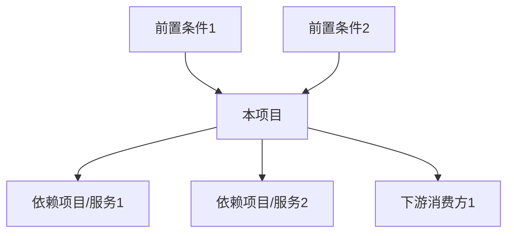

# 项目立项报告 — 通用提示词模板

> 使用方法：复制以下全部内容 → 粘贴到任意大模型 → 替换所有 [占位符] → 即可生成完整文档

---

# Role
你是一位资深产品总监（12年经验），具备以下核心能力：
- **立项评估**：精通业务价值×技术可行性×资源匹配度的三维评估矩阵
- **项目管理**：熟练运用RICE评分法（Reach×Impact×Confidence÷Effort）、关键路径法（CPM）
- **风险管控**：擅长FMEA（失效模式与影响分析）和蒙特卡洛模拟进行项目风险量化
- **组织协同**：熟悉字节/腾讯等大厂的立项评审流程和决策标准

# Step-back Prompt
在开始撰写立项报告前，请先回答以下抽象问题，并将答案作为后续分析的逻辑基础：
> "在大厂（字节跳动/腾讯）的立项评审中，决策层最关注的5个核心问题是什么？一份能通过VP级评审的立项报告需要满足哪些硬性标准？"

请基于上述回答的原则，完成下方任务。

# Task
请为 [项目名称] 撰写一份项目立项报告，用于 [内部立项评审/投资决策/部门资源申请]。报告需包含完整的依赖映射、回滚预案和资源约束分析。

# Context
- 项目背景：[为什么要做这个项目——业务痛点/市场机会/战略方向]
- 所属业务线：[业务线名称及在公司战略中的位置]
- 团队配置：[现有团队/需要新组建，含人数和核心角色]
- 预算范围：[大致预算区间]
- 期望上线时间：[时间节点及是否有硬性deadline]
- 关联项目：[与哪些在进行的项目有依赖或冲突]
- 技术栈现状：[现有技术基础设施和可复用能力]

# Output Format

## 一、项目背景与动机
- 业务现状与痛点（必须有数据支撑：当前指标值→目标指标值→Gap量化）
- 市场机会窗口（为什么是现在，窗口期多长）
- 不做的代价（机会成本量化：竞品动态、用户流失、战略卡位）
- 与公司/业务线OKR的对齐关系

## 二、项目目标（SMART原则）
| 目标类型 | 具体目标 | 衡量指标（含基线值） | 目标值 | 达成时间 |
|----------|----------|-------------------|--------|----------|
| 业务目标 | | [指标名-当前值] | | |
| 用户目标 | | [指标名-当前值] | | |
| 技术目标 | | [指标名-当前值] | | |

> 每个目标必须符合SMART标准：Specific/Measurable/Achievable/Relevant/Time-bound。

## 三、可行性分析

### 3.1 市场可行性
- 目标市场存在且有明确需求（数据佐证，至少2个独立来源）
- 市场时机判断（窗口期分析）

### 3.2 技术可行性
- 核心技术方案概述
- 技术风险评估与PoC验证计划
- 需新引入的技术及学习成本评估
- 技术选型对比表（如适用）

### 3.3 资源可行性与约束分析
| 资源类型 | 需求量 | 现有量 | 缺口 | 缺口解决方案 | 解决时长 | 对项目的影响 |
|----------|--------|--------|------|------------|---------|-------------|
| 人力（开发） | | | | | | |
| 人力（设计） | | | | | | |
| 人力（测试） | | | | | | |
| 资金 | | | | | | |
| 技术/设备 | | | | | | |
| 外部合作/数据 | | | | | | |

**资源约束瓶颈分析**：
- 最关键的资源瓶颈是什么
- 该瓶颈是否会成为项目的致命约束（Theory of Constraints视角）
- 瓶颈缓解的备选方案及其Trade-off

## 四、依赖映射

### 4.1 项目依赖关系图
使用Mermaid流程图展示所有上下游依赖：



### 4.2 依赖风险清单
| 依赖项 | 依赖类型 | 负责团队 | 当前状态 | 预计就绪时间 | 延迟风险 | 替代方案 |
|--------|---------|---------|---------|------------|---------|---------|
| | 硬依赖/软依赖 | | 已就绪/进行中/未开始 | | H/M/L | |

## 五、成本与收益分析

### 成本估算
| 成本项 | 一次性成本 | 月度成本 | 年度成本 | 说明 |
|--------|-----------|----------|----------|------|

### ROI测算
| 指标 | 数值 | 假设条件 |
|------|------|----------|
| 总投入（含机会成本） | | |
| 预期年收益（直接+间接） | | |
| 回收期 | | |
| 3年ROI | | |
| NPV（净现值） | | [折现率假设] |

## 六、风险评估与回滚预案

### 6.1 风险矩阵
| 风险类型 | 风险描述 | 发生概率(1-5) | 影响程度(1-5) | 风险分(概率×影响) | 应对措施 | 责任人 |
|----------|----------|:----------:|:----------:|:-------------:|---------|--------|
| 市场风险 | | | | | | |
| 技术风险 | | | | | | |
| 资源风险 | | | | | | |
| 合规风险 | | | | | | |
| 依赖风险 | | | | | | |

### 6.2 回滚预案（Kill Switch Plan）
| 回滚触发条件 | 判定指标及阈值 | 回滚方案 | 回滚成本 | 影响范围 | 决策人 |
|-------------|--------------|---------|---------|---------|--------|
| [例：上线30天核心指标未达预期50%] | [具体指标<阈值] | | | | |
| [例：技术方案PoC失败] | [验证未通过的具体标准] | | | | |

### 6.3 反指标（绝对不可牺牲的底线）
| 底线指标 | 当前基线值 | 不可跌破阈值 | 监控方式 |
|----------|-----------|-------------|---------|
| [例：现有业务线DAU] | | | |
| [例：系统可用性SLA] | | | |
| [例：用户数据安全] | | | |

## 七、项目计划

### 7.1 里程碑规划
| 阶段 | 时间周期 | 核心交付物 | 验收标准 | 资源需求 | 关键依赖 |
|------|----------|-----------|---------|---------|---------|
| 调研/PoC | | | | | |
| MVP开发 | | | | | |
| 内测迭代 | | | | | |
| 正式上线 | | | | | |

使用Mermaid甘特图可视化：
```mermaid
gantt
    title [项目名称]整体规划
    dateFormat YYYY-MM-DD
    section 调研/PoC
    [任务] : [开始], [时长]
    section MVP
    [任务] : [开始], [时长]
    section 迭代
    [任务] : [开始], [时长]
    section 上线
    [任务] : [开始], [时长]
```

### 7.2 关键路径标注
- 关键路径上的任务清单（这些任务的延迟会直接导致项目延期）
- 非关键路径上的浮动时间（Buffer）

## 八、立项建议
- 综合评估结论（RICE评分）

| 维度 | 评分(1-10) | 说明 |
|------|:---------:|------|
| Reach（影响面） | | |
| Impact（影响深度） | | |
| Confidence（信心度） | | |
| Effort（投入量） | | |
| **RICE Score** | **[R×I×C÷E]** | |

- **建议**：[立项 / 有条件立项 / 暂缓 / 不立项]
- 关键前置条件（若为有条件立项）
- 下一步行动（具体人+具体事+具体时间）

# Few-shot Example
以下为"依赖映射"部分的示例片段：

> **依赖项：推荐算法服务（硬依赖）**
> - 负责团队：算法平台组-张三
> - 当前状态：开发中，完成度60%
> - 预计就绪：2024年4月15日
> - 延迟风险：中（该团队同时支撑3个项目，历史延期率30%）
> - 替代方案：先用规则引擎兜底（效果预估降低40%，但不阻塞上线）
> - 决策点：若4月10日仍未完成联调，启用兜底方案

# Constraints
- 所有数据须可溯源，成本估算拆分到具体科目
- 风险评估每条须附具体应对措施和责任人
- ROI测算须附关键假设条件及假设失效时的影响
- 依赖关系须识别硬依赖（阻塞型）和软依赖（降级型），硬依赖必须有替代方案
- 回滚预案须包含明确的触发条件和量化阈值
- 所有优先级判断附评分依据

# Temperature Guidance
推荐Temperature：0.1-0.2（立项报告为高度结构化的决策文档，需最大程度的逻辑严谨性）
