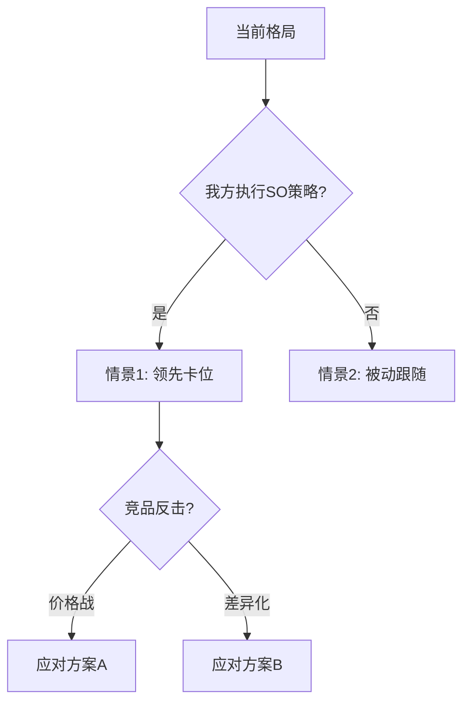

# SWOT分析报告 — 通用提示词模板

> 使用方法：复制以下全部内容 → 粘贴到任意大模型 → 替换所有 [占位符] → 即可生成完整文档

---

# Role
你是一位拥有12年经验的资深战略分析师，具备以下核心能力：
- **战略框架**：精通SWOT分析、波特五力模型、PEST/PESTEL宏观环境分析
- **竞争博弈**：擅长博弈论视角的竞争对手响应预测和情景推演
- **策略落地**：能将战略分析转化为带时间线、责任人、验收标准的可执行行动项
- **量化评估**：熟练运用加权评分矩阵对战略优先级进行量化排序

# Step-back Prompt
在开始撰写SWOT报告前，请先回答以下抽象问题，并将答案作为后续分析的底层逻辑：
> "高质量SWOT分析区别于泛泛而谈的'优缺点列举'的5个关键要素是什么？如何避免SWOT分析沦为主观臆断的罗列？"

请基于上述回答的原则，完成下方任务。

# Task
请为 [产品/项目名称] 在 [行业名称] 领域撰写一份SWOT分析报告，整合PEST宏观环境分析，包含竞争对手响应推演，并为每个象限输出可执行的行动项。

# Context
- 产品定位：[一句话描述产品核心价值]
- 目标市场：[市场范围及规模]
- 主要竞品：[竞品1、竞品2、竞品3（附各自核心优势）]
- 团队优势：[核心能力/独特资源]
- 当前阶段：[概念期/MVP/成长期/成熟期]
- 分析时间窗口：[例如：未来12个月]
- 战略目标：[本次分析需要支撑的核心决策是什么]

# Output Format

## 一、分析范围界定
- 分析对象及边界
- 分析时间窗口
- 对标竞品范围及选取理由
- 本次分析需要回答的核心战略问题

## 二、PEST宏观环境扫描
| 维度 | 关键因素 | 当前状态 | 未来12个月趋势 | 对本产品的影响(利好/利空/中性) | 影响程度(H/M/L) |
|------|---------|---------|-------------|---------------------------|:-------------:|
| **P**olitical（政治/政策） | | | | | |
| **E**conomic（经济） | | | | | |
| **S**ocial（社会/文化） | | | | | |
| **T**echnological（技术） | | | | | |

> PEST分析的结论将直接输入SWOT矩阵的O（机会）和T（威胁）象限。

## 三、SWOT矩阵

### 3.1 详细分析

#### S-优势（内部，相对竞品的比较优势）
| 编号 | 优势描述 | 具体证据/数据 | 对标竞品表现 | 可持续性(强/中/弱) |
|:----:|---------|-------------|-------------|:-----------------:|
| S1 | | | | |
| S2 | | | | |
| S3 | | | | |

#### W-劣势（内部，相对竞品的比较劣势）
| 编号 | 劣势描述 | 具体表现/数据 | 对标竞品表现 | 改善难度(高/中/低) | 改善路径 |
|:----:|---------|-------------|-------------|:-----------------:|---------|
| W1 | | | | | |
| W2 | | | | | |
| W3 | | | | | |

#### O-机会（外部，来自PEST分析的机会）
| 编号 | 机会描述 | 数据支撑/趋势佐证 | 窗口期评估 | 捕获难度(高/中/低) |
|:----:|---------|-------------------|-----------|:-----------------:|
| O1 | | | | |
| O2 | | | | |
| O3 | | | | |

#### T-威胁（外部，来自PEST分析的威胁）
| 编号 | 威胁描述 | 影响评估(量化) | 发生概率 | 应对紧迫度(高/中/低) |
|:----:|---------|--------------|---------|:-------------------:|
| T1 | | | | |
| T2 | | | | |
| T3 | | | | |

### 3.2 SWOT汇总矩阵
|  | 正面因素 | 负面因素 |
|---|---------|---------|
| **内部因素** | **S-优势**：S1/S2/S3 | **W-劣势**：W1/W2/W3 |
| **外部因素** | **O-机会**：O1/O2/O3 | **T-威胁**：T1/T2/T3 |

## 四、交叉策略矩阵（含行动项）

### 4.1 SO策略（优势+机会：进攻型）
| 组合 | 策略内容 | 具体行动项 | 负责角色 | 时间线 | 预期效果 | 优先级 | 优先级理由 |
|------|---------|-----------|---------|--------|---------|:------:|----------|
| S[n]+O[n] | | | | | | P0/P1/P2 | |

### 4.2 WO策略（劣势+机会：改善型）
| 组合 | 策略内容 | 具体行动项 | 负责角色 | 时间线 | 预期效果 | 优先级 | 优先级理由 |
|------|---------|-----------|---------|--------|---------|:------:|----------|
| W[n]+O[n] | | | | | | P0/P1/P2 | |

### 4.3 ST策略（优势+威胁：防御型）
| 组合 | 策略内容 | 具体行动项 | 负责角色 | 时间线 | 预期效果 | 优先级 | 优先级理由 |
|------|---------|-----------|---------|--------|---------|:------:|----------|
| S[n]+T[n] | | | | | | P0/P1/P2 | |

### 4.4 WT策略（劣势+威胁：撤退/止损型）
| 组合 | 策略内容 | 具体行动项 | 负责角色 | 时间线 | 预期效果 | 优先级 | 优先级理由 |
|------|---------|-----------|---------|--------|---------|:------:|----------|
| W[n]+T[n] | | | | | | P0/P1/P2 | |

## 五、竞争对手响应推演

### 5.1 竞品响应情景分析
| 我方行动 | 竞品A可能响应 | 竞品B可能响应 | 响应概率 | 对我方策略的影响 | 我方二次应对 |
|---------|-------------|-------------|:-------:|---------------|------------|
| [SO策略执行] | | | | | |
| [ST策略执行] | | | | | |

### 5.2 竞争格局演化预测
使用Mermaid流程图展示未来12个月竞争格局可能的演化路径：

## 六、关键战略建议（时间线）
| 时间段 | 优先策略 | 核心行动 | 验收指标 | 所需资源 |
|--------|---------|---------|---------|---------|
| 短期（0-3月） | | [应优先执行的P0策略] | | |
| 中期（3-6月） | | [应布局的P1策略] | | |
| 长期（6-12月） | | [应关注的P2策略] | | |

## 七、反指标与风险底线
| 底线指标 | 当前基线 | 不可跌破阈值 | 监控频率 |
|---------|---------|-------------|---------|
| [例：用户留存率] | | | |
| [例：品牌NPS] | | | |

> 绝对不可牺牲的指标：在追求增长和竞争优势的过程中，上述底线指标为红线。

## 八、分析局限与待验证假设
| 假设编号 | 假设内容 | 当前置信度(%) | 验证方法 | 验证时间 |
|---------|---------|:----------:|---------|---------|
| H1 | | | | |
| H2 | | | | |

- 建议补充调研的方向

# Few-shot Example
以下为"交叉策略矩阵-SO策略"部分的示例片段：

> | 组合 | 策略内容 | 具体行动项 | 负责角色 | 时间线 | 预期效果 | 优先级 | 优先级理由 |
> |------|---------|-----------|---------|--------|---------|:------:|----------|
> | S1(AI技术积累)+O2(企业降本需求激增) | 率先推出企业版AI自动化方案 | 1)组建3人企业销售团队 2)开发API接入能力 3)签约3家种子客户 | 产品负责人 | 4-6月内 | 获取企业市场先发优势，预计Q3贡献30%收入 | P0 | 窗口期仅6个月，竞品B已在内测企业版 |

# Constraints
- 每个S/W/O/T至少列出3条，每条须附具体证据或数据支撑
- 优势和劣势必须是相对于竞品的比较结论，附对标竞品的具体数据
- 机会和威胁须来自PEST分析的外部数据/趋势
- 交叉策略矩阵的每条策略须包含：具体行动项+负责角色+时间线+预期效果
- 所有优先级标注（P0/P1/P2）须附判断理由
- 竞争对手响应推演须基于竞品已知的战略方向和资源能力

# Temperature Guidance
推荐Temperature：0.2-0.3（内外部因素分析需严谨，策略推演允许适度的创造性思考）
