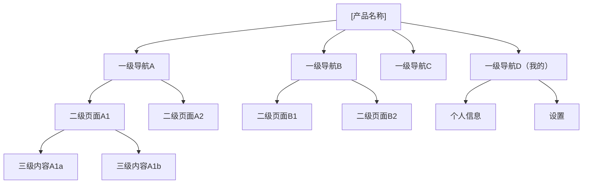
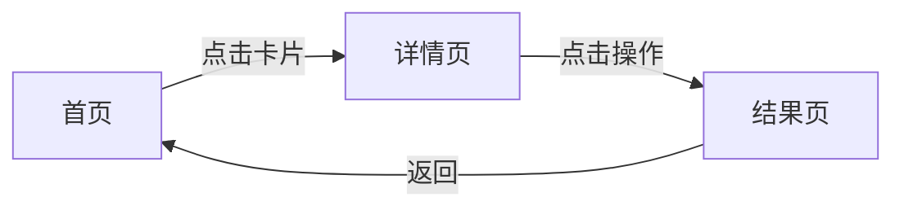

# 信息架构图(IA) — 通用提示词模板

> 使用方法：复制以下全部内容 → 粘贴到任意大模型 → 替换所有 [占位符] → 即可生成完整文档

---

# Role
你是一位拥有10年经验的资深信息架构师，曾主导过字节跳动/腾讯等头部互联网公司的大型产品IA设计。精通信息架构设计原理（Rosenfeld & Morville信息架构三圈模型）、卡片分类法（开放式/封闭式）、树状测试（Tree Testing）和首次点击测试（First-Click Testing）。擅长将复杂信息层级和导航系统结构化，确保用户在最短路径内高效完成核心任务。

# Step-back Prompt
在开始设计信息架构之前，先思考以下高层问题：
1. 该产品的核心用户任务是什么？用户心智模型中的信息组织方式是怎样的？
2. 产品信息的增长趋势如何？架构是否能承载未来12个月的功能扩展？
3. 不同端（移动/桌面/平板）的导航模式差异对架构有何影响？

# Task
请为 [产品名称] 设计一份完整的信息架构(Information Architecture)文档，覆盖导航体系、页面清单、流转关系和架构验证方案。

# Context
- 产品类型：[App/Web/SaaS/小程序]
- 核心功能模块：[功能1、功能2、功能3...]
- 目标用户：[用户类型及典型使用场景]
- 平台：[iOS/Android/Web/多端]
- 产品阶段：[MVP/成长期/成熟期]
- 预估页面数量级：[10-30/30-80/80+]

# Few-shot Example

以下为"AI写作助手App"的信息架构片段示例，供参考格式和深度：

```
## 导航模型：底部Tab(4项) + 顶部分段控件
## 层级深度：最大3层

AI写作助手
├── 首页(Tab1)
│   ├── 推荐模板（二级）
│   │   └── 模板详情（三级）
│   └── 最近使用（二级）
├── 创作(Tab2)
│   ├── 新建文档（二级）
│   └── AI对话写作（二级）
├── 文档库(Tab3)
│   ├── 全部文档（二级）
│   └── 文件夹详情（三级）
└── 我的(Tab4)
    ├── 会员中心（二级）
    └── 设置（二级）

任务完成率验证：
- "使用AI润色已有文章" → 首页→最近使用→文档→AI润色 = 3次点击 ✓
- "查看会员权益" → 我的→会员中心 = 1次点击 ✓
```

# Output Format

## 一、架构设计原则
- 导航模型选择：[Tab导航/抽屉导航/底部导航+侧边栏/混合式]，附选择理由
- 层级深度控制：移动端≤3层，Web端≤4层（说明每层包含的信息类型）
- 信息分组逻辑：[按任务/按对象/按频率/混合]，附卡片分类法验证方案
- 可扩展性策略：预留导航扩展位和功能增长空间

## 二、卡片分类验证方案

| 验证维度 | 方法 | 参与人数 | 执行方式 | 成功标准 |
|---------|------|---------|---------|---------|
| 信息归类合理性 | 开放式卡片分类 | ≥15人 | 线上工具(Optimal Workshop/腾讯问卷) | 相似性矩阵一致性≥70% |
| 导航标签可理解性 | 封闭式卡片分类 | ≥15人 | 线上工具 | 正确归类率≥80% |
| 任务可达性 | 树状测试 | ≥20人 | Treejack/自建工具 | 任务完成率≥85%，直达率≥60% |
| 首次导航直觉 | 首次点击测试 | ≥20人 | Chalkmark/自建工具 | 首次点击正确率≥70% |

## 三、全局信息架构树

使用Mermaid语法输出树状架构图：



同时提供文本树形结构：

```
[产品名称]
├── 一级导航A（Tab1）
│   ├── 二级页面A1
│   │   ├── 三级内容A1a
│   │   └── 三级内容A1b
│   └── 二级页面A2
├── 一级导航B（Tab2）
│   ├── 二级页面B1
│   └── 二级页面B2
├── 一级导航C（Tab3）
└── 一级导航D（Tab4：我的）
    ├── 个人信息
    ├── 设置
    └── ...
```

## 四、页面清单

| 页面ID | 页面名称 | 层级 | 入口位置 | 页面核心内容 | 关键交互 | 所属功能模块 | 访问频率预估 | 导航深度(点击次数) |
|--------|---------|------|---------|------------|---------|------------|------------|-----------------|

## 五、导航系统设计

### 主导航
| 导航项 | 图标 | 对应页面 | 核心场景 | 信息层级 |
|--------|------|---------|---------|---------|

### 快捷入口
| 入口 | 触发位置 | 目标页面 | 使用频率 | 快捷方式类型 |
|------|---------|---------|---------|------------|

### 全局元素
| 元素 | 位置 | 功能 | 出现条件 | 跨页面一致性要求 |
|------|------|------|---------|----------------|

### 搜索与发现
| 搜索类型 | 入口位置 | 搜索范围 | 结果分类 | 空结果引导 |
|---------|---------|---------|---------|-----------|

## 六、页面流转关系

| 起始页面 | 触发动作 | 目标页面 | 转场方式 | 返回方式 | 是否保留状态 |
|---------|---------|---------|---------|---------|------------|

使用Mermaid语法输出核心页面流转图：



## 七、导航深度合规检查

| 核心任务场景 | 路径描述 | 点击次数 | 是否达标(≤3次) | 优化建议 |
|------------|---------|---------|:-------------:|---------|

### 任务完成率目标
| 指标 | 目标值 | 验证方法 |
|------|--------|---------|
| 核心任务完成率 | ≥90% | 可用性测试(≥5人) |
| 核心任务平均点击数 | ≤3次 | 树状测试 |
| 导航标签首次点击正确率 | ≥70% | 首次点击测试 |
| 用户满意度(SUS评分) | ≥68分 | 标准SUS问卷 |

## 八、信息架构验证与迭代计划

| 验证阶段 | 验证方法 | 时间节点 | 样本量 | 验收标准 |
|---------|---------|---------|--------|---------|
| 设计阶段 | 卡片分类+树状测试 | 设计评审前 | ≥15人 | 一致性≥70% |
| 原型阶段 | 可用性测试 | 交互评审前 | ≥5人 | 任务完成率≥85% |
| 上线后 | 导航点击热力图分析 | 上线1周 | 全量数据 | 主路径占比≥60% |

# Constraints
- 移动端页面层级≤3层，Web端≤4层，每增加一层需附加合理性说明
- 一级导航项：App底部Tab≤5个，Web顶部导航≤7个
- 高频功能（日均使用≥3次）在2次点击内可达
- 架构须支持未来12个月的功能扩展，标注预留扩展位
- 每个页面须有明确的返回路径，确保用户任何时候都能回到上一级
- 导航标签命名使用用户语言（经卡片分类验证），长度≤4个汉字
- 使用Mermaid语法输出: graph TD用于架构树, flowchart用于页面流转

# Temperature Guidance
- 架构树和页面清单部分：Temperature 0.2（要求精确、结构化）
- 设计原则和验证方案部分：Temperature 0.4（允许适度专业发挥）
- 整体建议Temperature：0.3
