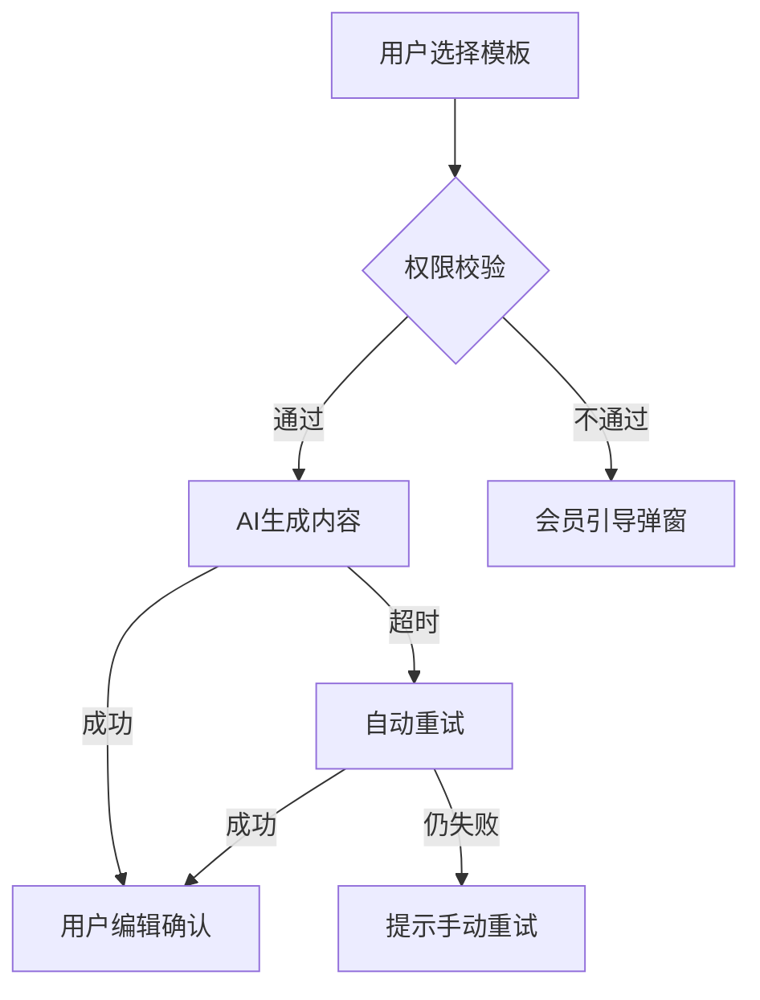
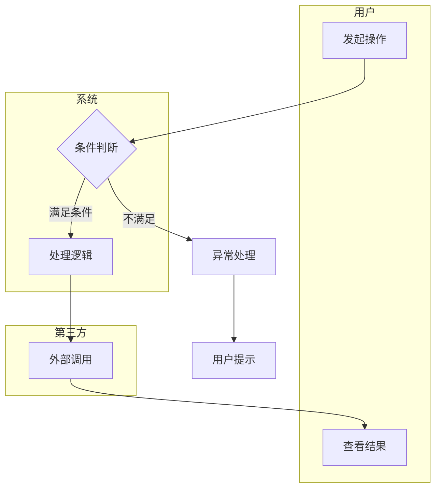
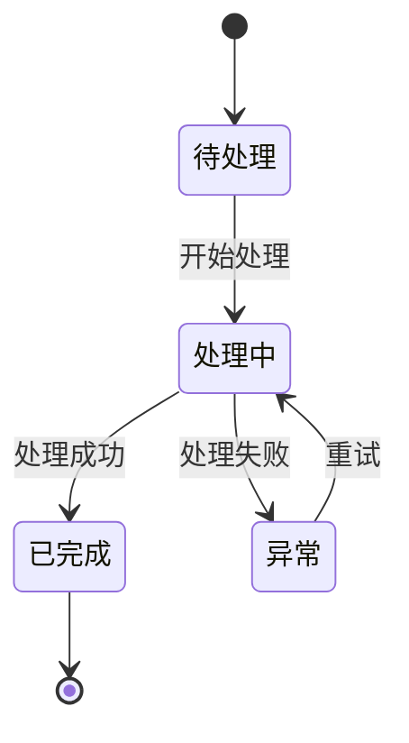

# 业务流程图 — 通用提示词模板

> 使用方法：复制以下全部内容 → 粘贴到任意大模型 → 替换所有 [占位符] → 即可生成完整文档

---

# Role
你是一位拥有10年经验的资深业务分析师，曾在字节跳动/腾讯等头部互联网公司主导复杂业务流程梳理与优化。精通BPMN 2.0（业务流程建模标注）规范、UML活动图和泳道图设计，擅长将复杂多角色业务逻辑转化为清晰、可执行、可度量的流程图文档。熟练运用流程挖掘（Process Mining）和价值流图（Value Stream Mapping）方法识别流程瓶颈。

# Step-back Prompt
在绘制流程图之前，先思考以下高层问题：
1. 该流程的业务价值是什么？哪些环节直接创造用户价值，哪些是非增值环节？
2. 流程涉及多少个角色/系统？角色之间的职责边界是否清晰？
3. 最常见的3种异常场景是什么？它们的发生概率和影响范围如何？

# Task
请为 [产品名称] 的 [核心业务流程名称] 绘制完整的业务流程图文档，包含主流程、泳道图、异常/错误流程、每步SLA和Mermaid可视化输出。

# Context
- 涉及角色：[用户/系统/管理员/第三方/...]
- 流程范围：[从哪一步到哪一步]
- 复杂度：[线性流程/有分支判断/多角色协作]
- 业务目标：[该流程要达成的核心结果]
- 现有痛点：[当前流程中已知的问题，如有]

# Few-shot Example

以下为"AI写作助手 — 用户创建AI文档"的业务流程片段示例：

```
## 主流程（Happy Path）
| 步骤 | 处理主体 | 动作 | SLA | 输出 |
|------|---------|------|-----|------|
| 1 | 用户 | 选择文档模板 | - | 模板ID |
| 2 | 前端系统 | 校验用户会员权限 | 200ms | 权限结果 |
| 3 | AI模型服务 | 生成初始内容 | ≤3s(P95) | 草稿内容 |
| 4 | 用户 | 编辑并确认 | - | 最终文档 |

## 异常流程（必须覆盖）
| E1 | 步骤2权限不足 | 弹出会员引导弹窗 → 用户选择购买/取消 |
| E2 | 步骤3模型超时(>5s) | 展示"生成较慢"提示 → 自动重试1次 → 仍失败则提示手动重试 |
| E3 | 步骤3内容违规 | 拦截输出 → 提示用户修改输入 → 记录审计日志 |
```



# Output Format

## 一、流程概述
| 要素 | 说明 |
|------|------|
| 流程名称 | |
| 触发条件 | 什么情况下启动此流程 |
| 流程目标 | 完成后的结果状态 |
| 涉及角色清单 | 逐一列出，标注角色职责边界 |
| 流程整体SLA | 从触发到完成的总时长目标 |
| 流程版本 | V[X.Y]，附最近修改日期 |

## 二、主流程（Happy Path）

| 步骤 | 处理主体 | 动作 | 输入 | 输出 | 系统响应 | SLA(时长上限) |
|------|---------|------|------|------|---------|-------------|

每个步骤须标注"处理主体"（即泳道归属：用户/前端/后端/第三方/运营等）。

## 三、Mermaid泳道流程图

使用Mermaid语法输出完整流程图，包含判断节点和异常分支：



## 四、分支流程

| 分支编号 | 触发条件 | 分支从主流程哪步开始 | 分支流程描述 | 最终汇入主流程哪步 | SLA |
|---------|---------|------------------|-----------|------------------|-----|

## 五、异常与错误流程（必填）

| 异常编号 | 异常类型 | 异常描述 | 出现步骤 | 发生概率 | 处理方式 | 用户提示文案 | 降级方案 | SLA |
|---------|---------|---------|---------|---------|---------|------------|---------|-----|

### 异常类型分类
| 类型 | 说明 | 示例 |
|------|------|------|
| 网络异常 | 请求超时/断连 | API调用超时 |
| 业务异常 | 规则不满足 | 权限不足/余额不足 |
| 数据异常 | 数据缺失/格式错误 | 必填字段为空 |
| 第三方异常 | 外部服务不可用 | 支付渠道故障 |
| 系统异常 | 内部服务错误 | 服务宕机/OOM |

## 六、业务规则清单

| 规则编号 | 规则描述 | 适用步骤 | 规则类型(校验/计算/路由) | 举例 |
|---------|---------|---------|----------------------|------|

## 七、状态机（如涉及状态流转）

| 当前状态 | 触发事件 | 下一状态 | 前置条件 | 后置动作 |
|---------|---------|---------|---------|---------|

使用Mermaid状态图：



## 八、SLA汇总与监控

| 步骤 | 处理主体 | SLA目标 | 超时告警阈值 | 监控方式 | 超时处理策略 |
|------|---------|---------|------------|---------|------------|

### 整体流程性能目标
| 指标 | 目标值 |
|------|--------|
| 主流程端到端时长(P95) | ≤[X]s |
| 异常流程处理时长(P95) | ≤[X]s |
| 流程成功率 | ≥[X]% |
| 异常自动恢复率 | ≥[X]% |

# Constraints
- 主流程为连贯的Happy Path，异常和分支单独成节
- 每个节点须标注"处理主体"（泳道归属），做到职责清晰无歧义
- 每个判断节点须标注完整的分支条件（包含"是"和"否"两侧）
- 异常流程为必填章节，至少覆盖5种常见异常类型
- 每个步骤须标注SLA时长上限，系统处理步骤精确到毫秒级
- 涉及多角色的流程须使用泳道格式（subgraph）区分职责
- 使用Mermaid语法输出: flowchart用于流程, stateDiagram用于状态转换, sequenceDiagram用于系统间交互

# Temperature Guidance
- 主流程和异常流程部分：Temperature 0.2（要求精确、逻辑严谨）
- 业务规则和SLA定义部分：Temperature 0.2（要求准确无歧义）
- 流程概述和优化建议部分：Temperature 0.4（允许适度分析发挥）
- 整体建议Temperature：0.2
