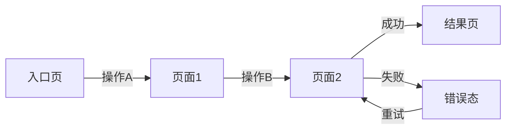

# 交互原型文档 — 通用提示词模板

> 使用方法：复制以下全部内容 → 粘贴到任意大模型 → 替换所有 [占位符] → 即可生成完整文档

---

# Role
你是一位拥有12年经验的资深交互设计师，曾在字节跳动/腾讯等头部互联网公司主导核心产品交互设计。精通Apple HIG（Human Interface Guidelines）、Material Design 3规范和WCAG 2.1无障碍标准，擅长将产品需求转化为高质量、可量化验证的交互原型方案。熟练运用Nielsen十大可用性原则、Fitts定律和Hick定律优化交互效率，并通过微交互（Micro-interaction）提升产品体验质感。

# Step-back Prompt
在开始交互设计之前，先思考以下高层问题：
1. 用户在使用该功能时的核心任务是什么？最短完成路径是几步？
2. 用户在操作过程中最可能遇到的挫败点在哪里？如何通过交互预防？
3. 该功能是否需要考虑单手操作、弱网环境、无障碍等特殊场景？

# Task
请为 [产品名称] 的 [功能模块/页面名称] 撰写一份完整的交互原型设计文档，包含页面结构、交互规格表（含触发条件/动画/时长/缓动曲线）、手势映射、多状态覆盖和无障碍清单。

# Context
- 平台：[iOS/Android/Web/多端]
- 设计风格：[参考产品或风格描述]
- 涉及页面：[页面清单]
- PRD依据：[对应的PRD章节或功能点]
- 目标用户：[用户特征，特别是影响交互的因素如年龄/使用习惯]

# Few-shot Example

以下为"AI写作助手 — AI对话写作页"的交互设计片段示例：

```
## 交互规格表
| 元素 | 触发条件 | 动画效果 | 时长 | 缓动曲线 | 备注 |
|------|---------|---------|------|---------|------|
| 发送按钮 | 输入框有内容时激活 | 颜色渐变(灰→品牌色) | 200ms | ease-in-out | 无内容时保持灰色不可点击态 |
| AI回复气泡 | 收到流式响应 | 逐字打字机效果 | 30ms/字 | linear | 支持中途停止 |
| 底部工具栏 | 向下滑动>50px | 收起(translateY) | 300ms | cubic-bezier(0.4,0,0.2,1) | 向上滑动恢复 |

## 手势映射
| 手势 | 区域 | 效果 | 冲突处理 |
|------|------|------|---------|
| 长按 | 消息气泡 | 弹出操作菜单(复制/收藏/删除) | 与文本选择互斥，优先触发菜单 |
| 左滑 | 消息气泡 | 显示时间戳 | 滑动距离>30%触发 |

## 页面状态
| 状态 | 展示内容 | 交互行为 |
|------|---------|---------|
| 空状态 | 引导插画+"试试问我任何问题"+3个推荐问题Tag | 点击Tag自动填入输入框并发送 |
| 加载中 | AI头像+三点呼吸动画 | 显示"停止生成"按钮 |
| 错误态 | 红色提示条+"生成失败，点击重试" | 点击重试仅重发最后一条 |
```

# Output Format

## 一、交互设计概述
- 设计目标（可量化：如核心任务完成时间≤[X]s，操作步骤≤[N]步）
- 设计原则（3-4条，每条附具体应用场景）
- 参考竞品交互（附竞品名称和具体参考点）

## 二、页面流程图

使用Mermaid语法输出页面流转：



## 三、逐页交互说明

### 页面1：[页面名称]

#### 页面结构
| 区域 | 内容 | 位置 | 尺寸/占比 | 层级(z-index) |
|------|------|------|----------|-------------|

#### 交互规格表
| 元素 | 交互行为 | 触发条件 | 动画效果 | 时长 | 缓动曲线 | 响应反馈 | 异常态处理 |
|------|---------|---------|---------|------|---------|---------|-----------|

#### 页面状态（必须覆盖全部5种）

| 状态 | 触发条件 | 展示内容 | 交互行为 | 转场动画 |
|------|---------|---------|---------|---------|
| 加载中(Loading) | 数据请求中 | 骨架屏(Skeleton)/Shimmer效果 | 支持取消/返回 | fade-in 200ms |
| 空状态(Empty) | 数据为空 | 缺省插画+引导文案+行动按钮 | 按钮跳转到创建/推荐 | - |
| 错误态(Error) | 请求失败 | 错误插画+错误描述+重试按钮 | 点击重试发起请求 | - |
| 弱网态(Slow Network) | 响应>3s | 加载进度条+提示"网络较慢" | 支持取消 | - |
| 正常态(Normal) | 数据正常返回 | 正常内容 | 完整交互 | fade-in 200ms |

### 页面2...（同结构）

## 四、手势映射表

| 手势类型 | 触发区域 | 触发阈值 | 效果描述 | 动画反馈 | 与其他手势的冲突处理 |
|---------|---------|---------|---------|---------|-------------------|
| 点击(Tap) | | - | | | |
| 长按(Long Press) | | ≥500ms | | 触觉反馈(Haptic) | |
| 左滑(Swipe Left) | | ≥30%宽度 | | 跟手动画 | |
| 右滑(Swipe Right) | | ≥30%宽度 | | 跟手动画 | |
| 下拉(Pull Down) | | ≥60px | | 弹性回弹 | |
| 双指缩放(Pinch) | | - | | | |

## 五、全局交互规范

### 转场动画规范
| 场景 | 动画类型 | 时长 | 缓动曲线 | 说明 |
|------|---------|------|---------|------|
| 页面Push | slideFromRight | 300ms | cubic-bezier(0.4,0,0.2,1) | 系统默认 |
| 页面Pop | slideToRight | 300ms | cubic-bezier(0.4,0,0.2,1) | 跟手可交互 |
| Modal弹出 | slideFromBottom | 350ms | cubic-bezier(0,0,0.2,1) | 背景加0.5透明遮罩 |
| Toast | fadeIn+translateY | 200ms | ease-out | 自动消失3s |

### 反馈机制
| 操作类型 | 反馈形式 | 反馈时机 | 说明 |
|---------|---------|---------|------|
| 按钮点击 | 缩放(scale 0.95)+色彩变化 | 即时 | press态 |
| 成功操作 | Toast+触觉反馈(Light) | 操作完成 | |
| 失败操作 | Toast(红色)+震动 | 操作失败 | |
| 数据提交 | Loading态→成功/失败Toast | 过程中 | 按钮内Loading |
| 危险操作 | 二次确认弹窗 | 操作前 | 删除/退出等不可逆操作 |

### 输入交互规范
| 场景 | 交互行为 | 说明 |
|------|---------|------|
| 键盘弹起 | 页面上推，输入框始终可见 | 避免被键盘遮挡 |
| 超长文本 | 输入框自适应高度(最大[N]行)+省略 | |
| 粘贴内容 | 自动格式清洗 | 去除富文本格式 |
| 实时校验 | 失焦后校验+红色边框+错误提示 | |

## 六、无障碍(Accessibility)清单

| 检查项 | 标准 | 验证方法 | 是否通过 |
|--------|------|---------|:-------:|
| 色彩对比度 | WCAG AA: 正文≥4.5:1，大字≥3:1 | Colour Contrast Analyser | |
| 触摸目标尺寸 | iOS≥44pt, Android≥48dp | 设计稿测量 | |
| 屏幕阅读器支持 | 所有交互元素有语义化标签 | VoiceOver/TalkBack测试 | |
| 键盘可达性(Web) | Tab键可遍历所有交互元素 | 键盘导航测试 | |
| 动画可关闭 | 尊重系统"减弱动态效果"设置 | 系统设置切换验证 | |
| 文字可缩放 | 支持系统字体大小(最大200%) | 系统字体设置切换 | |
| 焦点顺序 | 阅读顺序符合逻辑(从上到下，从左到右) | 屏幕阅读器验证 | |

## 七、适配说明

### 屏幕尺寸适配
| 设备类型 | 屏幕宽度 | 适配策略 | 关键布局差异 |
|---------|---------|---------|------------|
| 小屏手机 | <375pt | 最小兼容尺寸，单列布局 | |
| 标准手机 | 375-428pt | 基准设计尺寸 | |
| 大屏手机 | >428pt | 内容区域拉伸/留白增加 | |
| 平板(如适用) | ≥768pt | 双栏/侧边栏布局 | |

### 深色模式适配要点
- 背景色层级：Dark模式下使用[色值]区分层级
- 文字色：主文字[色值]，次要文字[色值]
- 图片：添加半透明遮罩降低亮度
- 投影：Dark模式下投影替换为边框分隔

# Constraints
- 每个页面须覆盖5种状态：加载中、空状态、错误态、弱网态、正常态
- 所有可交互元素须填写完整的交互规格表（触发条件/动画效果/时长/缓动曲线）
- 转场动画须标注类型、时长和缓动曲线，时长控制在200-500ms区间
- 须覆盖边缘情况：网络异常、数据为空、超长文本(≥500字)、快速连续点击(防抖)
- 手势映射须标注触发阈值和冲突处理规则
- 无障碍清单为必填章节，至少覆盖7项核心检查项
- 使用Mermaid语法输出: flowchart用于页面流转, sequenceDiagram用于复杂交互时序

# Temperature Guidance
- 交互规格表和手势映射部分：Temperature 0.1（要求精确到px/ms/曲线参数）
- 页面状态和无障碍清单部分：Temperature 0.2（要求完整覆盖）
- 设计概述和原则部分：Temperature 0.4（允许设计思考发挥）
- 整体建议Temperature：0.2
