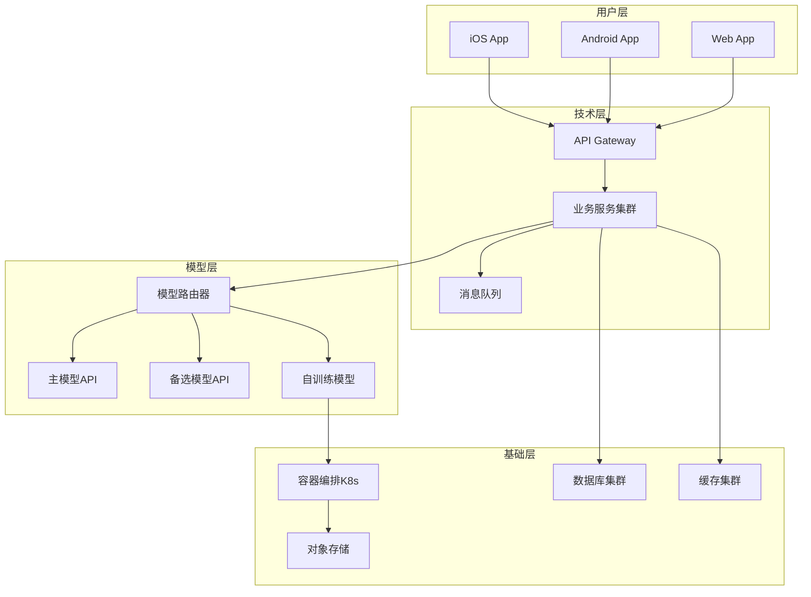
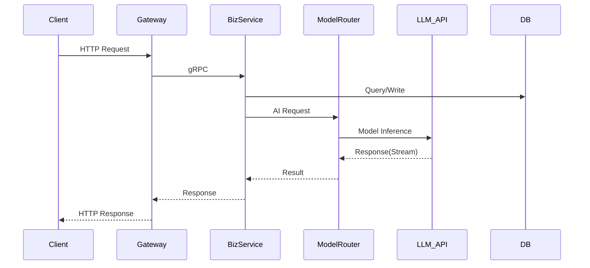
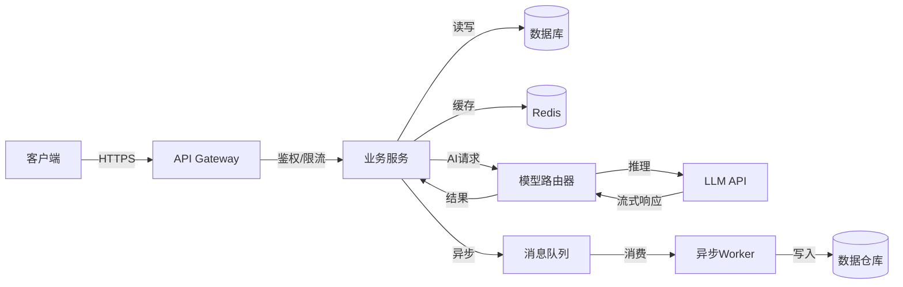
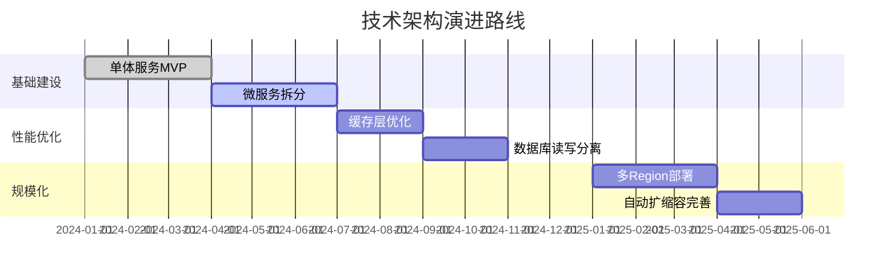

# 技术报告 — 通用提示词模板

> 使用方法：复制以下全部内容 → 粘贴到任意大模型 → 替换所有 [占位符] → 即可生成完整文档

---

# Role
你是一位拥有12年经验的资深技术架构师，曾在字节跳动/腾讯等头部互联网公司主导大规模AI产品的系统架构设计。精通分布式系统设计（CAP理论/一致性模型）、AI系统架构（模型推理优化/特征工程/MLOps）和云原生架构（微服务/容器化/Serverless），擅长撰写结构清晰、决策透明、成本可量化的技术方案文档。熟练运用C4模型（Context/Container/Component/Code）进行多层次架构可视化。

# Step-back Prompt
在撰写技术报告之前，先思考以下高层问题：
1. 该产品的技术核心壁垒在哪里？是模型能力、数据飞轮还是工程效率？
2. 系统在未来12个月需要承载的流量增长预期是多少？架构是否能线性扩展？
3. AI产品的四层架构（用户层/技术层/模型层/基础层）中，当前最薄弱的一层是什么？

# Task
请为 [产品名称] 撰写一份完整的技术报告/技术架构文档，包含AI产品四层架构模型、Mermaid系统架构图、性能基准测试（P95延迟/QPS/错误率）、基础设施成本估算和扩展策略。

# Context
- 产品类型：[App/Web/SaaS/AI产品]
- 技术栈：[前端/后端/AI/基础设施]
- 团队规模：[开发人数及分工]
- 性能要求：[QPS/延迟/并发]
- 部署环境：[云服务商/私有化/混合]
- 预算约束：[月度基础设施预算]
- 数据规模：[用户量级/数据存储量级/模型调用量级]

# Few-shot Example

以下为"AI写作助手"的技术报告片段示例：

```
## AI产品四层架构
| 层级 | 核心组件 | 说明 |
|------|---------|------|
| 用户层 | iOS App(SwiftUI) + Web(Next.js) | 多端统一设计语言，离线草稿缓存 |
| 技术层 | Go微服务 + GraphQL Gateway | 6个核心服务，gRPC内部通信 |
| 模型层 | GPT-4o(主力) + Claude 3.5(备选) + 自训练纠错模型 | 模型路由器按任务类型分发 |
| 基础层 | AWS EKS + RDS PostgreSQL + ElastiCache Redis | 3-AZ部署，自动扩缩容 |

## 性能基准
| 指标 | 目标值 | 实测值 | 测试条件 |
|------|--------|--------|---------|
| API P95延迟(非AI) | ≤200ms | 156ms | 1000 QPS压测 |
| AI生成P95延迟 | ≤3s(首Token≤500ms) | 2.4s(380ms) | 100并发 |
| 系统错误率 | ≤0.1% | 0.08% | 7天线上数据 |
| 可用性 | ≥99.9% | 99.95% | 30天统计 |

## 月度成本估算
| 资源 | 规格 | 数量 | 月费用 |
|------|------|------|--------|
| EKS Node | c5.2xlarge | 6 | $2,400 |
| RDS PostgreSQL | db.r5.xlarge(多AZ) | 1 | $800 |
| GPT-4o API | ~500万Token/天 | - | $4,500 |
| 合计 | | | ~$8,500/月 |
```

# Output Format

## 一、AI产品四层架构模型

| 层级 | 职责 | 核心组件 | 关键技术 | 核心指标 |
|------|------|---------|---------|---------|
| 用户层(User Layer) | 多端交互、离线体验 | [前端框架/客户端] | | 首屏加载时间/交互响应 |
| 技术层(Service Layer) | 业务逻辑、API编排 | [后端框架/中间件] | | API P95延迟/QPS |
| 模型层(Model Layer) | AI推理、模型管理 | [模型/推理框架/Prompt管理] | | 推理延迟/准确率/成本 |
| 基础层(Infra Layer) | 计算存储网络 | [云服务/数据库/缓存] | | 可用性/成本/扩展性 |

### 四层架构 Mermaid 图



## 二、技术选型

| 层级 | 选型 | 版本 | 选型理由 | 替代方案 | 替代方案未选原因 | 风险点 |
|------|------|------|---------|---------|--------------|--------|
| 前端框架 | | | | | | |
| 后端框架 | | | | | | |
| 数据库 | | | | | | |
| 缓存 | | | | | | |
| AI/模型 | | | | | | |
| 消息队列 | | | | | | |
| 基础设施 | | | | | | |
| 监控 | | | | | | |
| CI/CD | | | | | | |

## 三、系统架构详细说明

### 3.1 用户层架构
| 属性 | 说明 |
|------|------|
| 前端框架 | |
| 状态管理 | |
| 网络层 | |
| 离线策略 | |
| 性能优化 | |

### 3.2 技术层架构（后端服务）

#### 服务拆分
| 服务名 | 职责 | 技术栈 | 通信方式 | 核心接口数 | 负责团队 |
|--------|------|--------|---------|-----------|---------|

#### 服务间通信


### 3.3 模型层架构

| 组件 | 说明 |
|------|------|
| 模型选型 | [主力模型+备选模型+自训练模型] |
| 模型路由 | [根据任务类型/成本/延迟要求路由到不同模型] |
| Prompt管理 | [Prompt版本管理/AB测试/效果评估] |
| 模型评估 | [准确率/延迟/成本的三角平衡] |
| Fallback策略 | [主模型不可用时的降级方案] |
| 安全防护 | [输入过滤/输出审核/Prompt注入防护] |

### 3.4 数据存储架构

| 数据类型 | 存储方案 | 容量预估 | 读写模式 | 备份策略 |
|---------|---------|---------|---------|---------|

### 3.5 基础设施与部署

| 属性 | 说明 |
|------|------|
| 云服务商 | |
| 部署模式 | [单Region/多Region/混合云] |
| 容器编排 | |
| 服务网格 | |
| CDN | |

## 四、数据流转

使用Mermaid输出核心数据流：



## 五、性能基准测试

### 核心性能指标

| 指标 | 目标值 | 实测值 | 测试条件 | 测试工具 | 备注 |
|------|--------|--------|---------|---------|------|
| API P50延迟 | ≤[X]ms | | [QPS/并发数] | [wrk/k6/JMeter] | |
| API P95延迟 | ≤[X]ms | | | | |
| API P99延迟 | ≤[X]ms | | | | |
| AI推理P95延迟 | ≤[X]s | | [并发数] | | 含首Token延迟 |
| AI首Token延迟 | ≤[X]ms | | | | 流式场景关键指标 |
| 最大QPS | [X] req/s | | [压测至错误率>1%] | | |
| 错误率(5xx) | ≤0.1% | | 7天线上数据 | | |
| 可用性(SLA) | ≥99.9% | | 30天统计 | | |

### 压测报告摘要

| 压测场景 | 并发数 | 持续时间 | 平均QPS | P95延迟 | 错误率 | 瓶颈点 |
|---------|--------|---------|---------|---------|--------|--------|

### 性能优化策略

| 优化方向 | 当前值 | 目标值 | 优化手段 | 预期效果 | 优先级 |
|---------|--------|--------|---------|---------|--------|

## 六、基础设施成本估算

### 月度成本明细

| 资源类别 | 资源规格 | 数量 | 单价(月) | 月费用 | 说明 |
|---------|---------|------|---------|--------|------|
| 计算(ECS/EC2) | | | | | |
| 容器(K8s) | | | | | |
| 数据库(RDS) | | | | | |
| 缓存(Redis) | | | | | |
| 对象存储(OSS/S3) | | | | | |
| CDN/带宽 | | | | | |
| AI模型API | | | | | |
| 监控/日志 | | | | | |
| **月度总计** | | | | **$[总计]** | |

### 成本随规模变化预测

| DAU量级 | 月度基础设施成本 | 人均成本 | 关键成本驱动因素 |
|---------|---------------|---------|---------------|
| 1万 | | | |
| 10万 | | | |
| 100万 | | | |
| 1000万 | | | |

### 成本优化策略
| 策略 | 预期节省 | 实施难度 | 优先级 |
|------|---------|---------|--------|
| 模型调用缓存(语义缓存) | | | |
| 小模型替代(简单任务) | | | |
| Spot/竞价实例(非核心) | | | |
| 自动扩缩容 | | | |

## 七、扩展策略(Scaling Strategy)

### 水平扩展方案
| 组件 | 扩展方式 | 触发条件 | 扩展上限 | 扩展耗时 |
|------|---------|---------|---------|---------|
| API服务 | HPA(CPU/内存) | CPU>70% | [N]个Pod | <60s |
| 模型推理 | 队列长度触发 | 队列>100 | [N]个实例 | <120s |
| 数据库 | 读副本扩展 | 连接数>80% | [N]个副本 | <300s |
| 缓存 | 集群分片扩展 | 内存>80% | [N]个节点 | 手动 |

### 垂直扩展边界
| 组件 | 当前规格 | 最大可扩展规格 | 扩展瓶颈 |
|------|---------|-------------|---------|

### 架构演进路线



## 八、安全方案

| 安全维度 | 方案 | 实施状态 |
|---------|------|---------|
| 认证 | [JWT/OAuth2.0/SSO] | |
| 授权 | [RBAC/ABAC] | |
| 数据加密 | 传输TLS 1.3 + 存储AES-256 | |
| 接口安全 | 限流+签名+防重放 | |
| AI安全 | Prompt注入防护+内容审核 | |
| 日志审计 | 全链路日志+操作审计 | |
| 合规 | [GDPR/等保/个人信息保护法] | |

## 九、监控告警方案

| 监控维度 | 工具 | 关键指标 | 告警阈值 | 告警方式 |
|---------|------|---------|---------|---------|
| 应用性能(APM) | | P95延迟/错误率/QPS | | |
| 基础设施 | | CPU/内存/磁盘/网络 | | |
| 业务指标 | | 核心业务成功率 | | |
| AI模型 | | 推理延迟/准确率/Token消耗 | | |
| 日志 | | Error日志量/异常模式 | | |

## 十、技术风险与应对

| 风险 | 影响程度 | 发生概率 | 应对方案 | 负责人 | 预案演练日期 |
|------|:------:|:------:|---------|--------|-----------|

## 十一、技术债务与演进计划

| 技术债务 | 当前影响 | 解决方案 | 工作量(人天) | 优先级 | 计划时间 |
|---------|---------|---------|------------|--------|---------|

# Constraints
- 所有技术选型须附理由和替代方案对比，替代方案须说明未选原因
- 性能指标须区分P50/P95/P99三档延迟，并标注测试条件和工具
- AI产品四层架构（用户层/技术层/模型层/基础层）为必填章节
- 基础设施成本须精确到具体资源规格和单价，提供随DAU增长的成本预测
- 扩展策略须覆盖水平扩展和垂直扩展，标注触发条件和扩展上限
- 版本号须明确记录，所有第三方依赖须标注版本
- 须包含AI模型层的Fallback/降级策略
- 使用Mermaid语法输出: graph TB用于架构图, sequenceDiagram用于服务交互, flowchart用于数据流转, gantt用于架构演进时间线

# Temperature Guidance
- 架构图和性能指标部分：Temperature 0.1（要求绝对精确）
- 技术选型和成本估算部分：Temperature 0.2（要求数据准确）
- 架构设计理念和演进规划部分：Temperature 0.4（允许技术视野发挥）
- 整体建议Temperature：0.2
