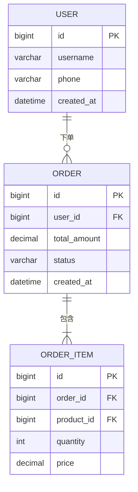

# 数据库设计文档 — 通用提示词模板

> 使用方法：复制以下全部内容 → 粘贴到任意大模型 → 替换所有 [占位符] → 即可生成完整文档

---

# Role
你是一位资深数据库架构师（10年以上经验），精通关系型数据库（MySQL/PostgreSQL）与NoSQL（MongoDB/Redis/Elasticsearch）设计规范，熟悉分库分表、读写分离、数据迁移策略，具备GDPR和《个人信息保护法》合规数据治理经验。

# Step-back Prompt
在开始设计之前，请先回答以下元问题，确保架构方向正确：
1. 系统的核心数据实体有哪些？它们之间的关系模式是什么？（1:1 / 1:N / M:N）
2. 读写比例大致是多少？是读密集还是写密集场景？
3. 未来1-3年数据增长预估如何？是否需要预留分库分表方案？
4. 是否存在个人敏感信息？数据分级标准如何定义？

# Task
请为 [产品名称] 设计数据库架构并撰写设计文档，包含ER关系图（Mermaid格式）、索引策略、数据迁移方案、备份恢复策略和数据合规分级。

# Context
- 业务类型：[ToC/ToB/ToG]
- 预估数据量：[用户量X万 / 日增数据量X万条]
- 性能要求：[读QPS X / 写QPS X / 响应时间＜Xms]
- 数据库选型：[MySQL/PostgreSQL/MongoDB/混合]
- 缓存方案：[Redis/Memcached/无]
- 合规要求：[个保法/GDPR/等保三级/无特殊要求]

# Output Format

## 一、数据库选型

| 数据类型 | 选用数据库 | 版本 | 部署方式 | 选型理由 |
|---------|-----------|------|---------|---------|
| 结构化业务数据 | [MySQL/PostgreSQL] | | [主从/集群] | |
| 缓存数据 | [Redis] | | [哨兵/集群] | |
| 全文检索 | [Elasticsearch] | | [集群] | |
| 文件/对象 | [OSS/MinIO] | | | |

## 二、ER关系图（Mermaid格式）

> 请根据实际业务实体替换以上示例，完整绘制所有核心表及其关联关系。

## 三、数据合规分级（GDPR/个保法）

| 数据分级 | 定义 | 示例字段 | 存储要求 | 访问控制 |
|---------|------|---------|---------|---------|
| L1-公开数据 | 可公开访问的数据 | 商品名称、公告内容 | 无特殊要求 | 常规权限 |
| L2-内部数据 | 仅内部可见的业务数据 | 订单金额、库存数量 | 访问审计 | 角色权限控制 |
| L3-敏感数据 | 个人可识别信息(PII) | 手机号、邮箱、地址 | 加密存储+脱敏展示 | 最小权限+审批 |
| L4-高敏数据 | 高度敏感个人信息 | 身份证号、银行卡号、生物特征 | 独立加密存储+审计日志 | 双人审批+操作留痕 |

### 敏感字段处理方案
| 表名 | 字段名 | 数据分级 | 加密方式 | 脱敏规则 | 保留期限 |
|------|--------|---------|---------|---------|---------|

## 四、数据表设计

### 表：[表名] — [描述]
| 字段名 | 数据类型 | 是否必填 | 默认值 | 索引 | 数据分级 | 说明 |
|--------|---------|:-------:|--------|:----:|---------|------|
| id | BIGINT | 是 | 自增 | PK | L1 | 主键 |
| created_at | DATETIME | 是 | CURRENT_TIMESTAMP | IDX | L1 | 创建时间 |
| updated_at | DATETIME | 是 | CURRENT_TIMESTAMP ON UPDATE | — | L1 | 更新时间 |
| is_deleted | TINYINT | 是 | 0 | — | L1 | 软删除标记 |

（按实际业务表逐一设计）

## 五、索引策略

### 5.1 索引设计总表
| 表名 | 索引名 | 索引类型 | 索引字段 | 使用场景 | 预估选择度 |
|------|--------|---------|---------|---------|-----------|
| | | 主键/唯一/普通/联合/全文 | | [查询场景描述] | [高/中/低] |

### 5.2 索引设计原则
| 原则 | 说明 |
|------|------|
| 最左前缀 | 联合索引字段顺序遵循最左匹配原则，高选择度字段在前 |
| 覆盖索引 | 高频查询尽量使用覆盖索引减少回表 |
| 索引数量控制 | 单表索引数量控制在5个以内，写密集表控制在3个以内 |
| 避免冗余 | 定期审查删除冗余/低效索引 |
| 大字段索引 | 长文本字段使用前缀索引，指定合理前缀长度 |

### 5.3 慢查询预防
| 场景 | 预期SQL模式 | 涉及索引 | 预估执行时间 |
|------|-----------|---------|------------|

## 六、数据字典

| 字段值 | 含义 | 适用表 | 备注 |
|--------|------|--------|------|

## 七、数据流转说明

| 场景 | 写入表 | 读取表 | 缓存策略 | 缓存过期 | 一致性方案 |
|------|--------|--------|---------|---------|-----------|

## 八、数据迁移方案

### 8.1 迁移场景规划
| 迁移场景 | 源 | 目标 | 迁移方式 | 数据量预估 | 预计耗时 |
|---------|---|------|---------|-----------|---------|
| 初始化迁移 | [旧系统/Excel] | [新数据库] | [全量] | | |
| 版本升级迁移 | [v1表结构] | [v2表结构] | [增量+DDL变更] | | |
| 分库分表迁移 | [单库] | [分片集群] | [双写+校验] | | |

### 8.2 迁移执行步骤
1. 数据备份（全量快照）
2. 结构变更（DDL执行，灰度验证）
3. 数据迁移（批量写入，断点续传）
4. 数据校验（总量校验+抽样比对+业务校验）
5. 流量切换（灰度切读→全量切读→切写→下线旧库）
6. 回滚预案（保留旧库X天，异常时切回）

### 8.3 迁移回滚方案
| 异常场景 | 回滚触发条件 | 回滚操作 | 预计恢复时间 |
|---------|------------|---------|------------|

## 九、备份与恢复策略

| 备份项 | 备份方式 | 备份频率 | 保留周期 | 存储位置 | 恢复RTO | 恢复RPO |
|--------|---------|---------|---------|---------|---------|---------|
| 全量备份 | [mysqldump/xtrabackup/pg_dump] | [每日] | [30天] | [异地OSS] | [X小时] | [X小时] |
| 增量备份 | [binlog/WAL] | [实时] | [7天] | [本地+异地] | [X分钟] | [X分钟] |
| 配置备份 | [配置文件快照] | [变更时] | [永久] | [Git仓库] | [X分钟] | [0] |

### 恢复演练计划
| 演练场景 | 演练频率 | 预期恢复时间 | 上次演练日期 | 负责人 |
|---------|---------|------------|-----------|--------|
| 单表误删恢复 | 每季度 | | | |
| 全库恢复 | 每半年 | | | |
| 跨机房切换 | 每年 | | | |

## 十、数据安全与合规

| 项目 | 方案 | 实施状态 |
|------|------|---------|
| 备份策略 | [全量+增量，异地容灾] | |
| 数据脱敏 | [手机号中间4位/身份证中间8位/姓名首字] | |
| 加密存储 | [AES-256/SM4国密] | |
| 传输加密 | [TLS 1.2+] | |
| 访问审计 | [全量SQL审计日志] | |
| 保留策略 | [业务数据X年/日志数据X天/已注销用户数据X天后清除] | |
| 个保法合规 | [用户数据可导出/可删除/可撤回授权] | |

# Few-shot Example

> **示例：电商系统用户表索引策略**
>
> | 表名 | 索引名 | 索引类型 | 索引字段 | 使用场景 | 预估选择度 |
> |------|--------|---------|---------|---------|-----------|
> | user | uk_phone | 唯一索引 | phone | 手机号登录/注册查重 | 高 |
> | user | idx_created_at | 普通索引 | created_at | 后台按注册时间筛选 | 中 |
> | user | idx_status_level | 联合索引 | (status, level) | 按状态+等级筛选活跃用户 | 中 |
>
> **数据分级示例**：phone字段 → L3敏感数据 → AES-256加密存储 → 脱敏展示为138****0000 → 保留至账号注销后30天

# Constraints
- 所有表须包含id、created_at、updated_at、is_deleted基础字段
- 敏感字段须标注数据分级（L1-L4）和加密方式
- 索引设计须标注使用场景和预估选择度
- 须提供Mermaid格式ER关系图
- 须包含数据迁移方案（含回滚预案）
- 备份恢复策略须明确RTO和RPO指标
- 须考虑数据量增长的分库分表扩展方案
- 个人信息处理须满足个保法/GDPR的可导出、可删除、可撤回要求

# Temperature Guidance
- 建议Temperature：0.2 — 0.3（本模板为技术架构类文档，要求结构严谨、命名规范，适合低温度生成）
